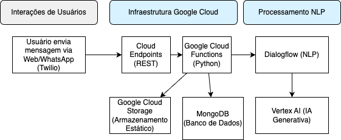

# Arquitetura de Chatbot Inteligente com Google Cloud

Essa arquitetura, baseada em Google Cloud, oferece uma solução completa para a criação de chatbots inteligentes e escaláveis, capazes de interagir com usuários através de diversos canais, como web e WhatsApp. O chatbot **Dra Jo** utiliza a flexibilidade do Google Cloud com a precisão do Dialogflow para criar conversas naturais e personalizadas.

## Diagrama da Arquitetura

## Fluxo de Conversação
1. **Interação do Usuário**: O usuário inicia uma conversa através da web ou do WhatsApp. As mensagens são enviadas para o Google Cloud Endpoints.
2. **Processamento da Mensagem**: O Google Cloud Endpoints direciona a mensagem para o Dialogflow, que utiliza técnicas avançadas de NLP para entender a intenção do usuário.
3. **Geração da Resposta**: Com base na intenção identificada, o Dialogflow gera uma resposta personalizada ou aciona uma ação específica, como buscar informações em um banco de dados.
4. **Armazenamento de Dados**: O histórico da conversa, preferências do usuário e outros dados relevantes são armazenados no MongoDB para análise e personalização futura.
5. **Resposta ao Usuário**: A resposta gerada pelo Dialogflow é enviada de volta ao usuário através do canal original (web ou WhatsApp).

## Componentes-chave
- **Dialogflow**: Motor de NLP que compreende a linguagem natural e gera respostas personalizadas.
- **Google Cloud Functions**: Backend escalável para executar a lógica do chatbot e integrar com outros serviços.
- **MongoDB**: Banco de dados NoSQL para armazenar dados não estruturados de forma flexível.
- **Google Cloud Endpoints**: API Gateway para gerenciar o tráfego e garantir a segurança.
- **Twilio**: Plataforma de comunicação em nuvem para integrar o chatbot com o WhatsApp.
- **Vertex AI**: Fornece capacidades de IA generativa para criar respostas mais criativas e personalizadas.

## Benefícios
- **Escalabilidade**: A arquitetura em nuvem permite escalar o chatbot para atender a um grande número de usuários.
- **Flexibilidade**: A utilização de containers e funções serverless facilita a adição de novas funcionalidades.
- **Personalização**: O Dialogflow e o Vertex AI permitem criar experiências personalizadas para cada usuário.
- **Integração**: A integração com o WhatsApp amplia o alcance do chatbot e permite alcançar um público mais amplo.

Essa arquitetura oferece uma base sólida para a criação de chatbots inteligentes e personalizados, capazes de atender às necessidades de diversos setores e empresas.

## Resultados Esperados
- **Automatização de Processos**: O chatbot automatiza o atendimento e agendamentos, reduzindo a carga de trabalho humano e permitindo respostas 24/7.
- **Escalabilidade**: A arquitetura suporta o crescimento da empresa, permitindo o aumento da demanda sem degradação de desempenho.
- **Satisfação do Cliente**: Respostas rápidas e consistentes elevam a satisfação e fidelização dos clientes.

## Valores Agregados ao Modelo de Negócio
- **Eficiência Operacional**: Com o chatbot lidando com perguntas frequentes, a equipe pode focar em atividades mais complexas.
- **Aumento de Receitas**: Com mais facilidade para agendamentos e suporte rápido, a empresa deve converter mais leads e aumentar a retenção de clientes.
- **Melhoria no Atendimento**: O chatbot coleta dados valiosos, que podem ser usados para ajustar os produtos e serviços.

## Possíveis Extensões
- **Integração com outros canais**: Adicionar suporte a outros canais de comunicação, como Telegram ou Facebook Messenger.
- **Análise de sentimentos**: Utilizar técnicas de análise de sentimentos para identificar a emoção do usuário e ajustar as respostas.
- **Aprendizado de máquina**: Implementar modelos de aprendizado de máquina para melhorar a precisão do Dialogflow e personalizar a experiência do usuário ao longo do tempo.

## Previsão de Custos
A seguir, uma previsão de custos estimada para a operação da arquitetura de chatbot inteligente, considerando os componentes principais implementados para o agente 'Dra Jo'. A previsão é uma estimativa que pode variar dependendo do uso e de fatores específicos de configuração.

| Componente             | Descrição                                                      | Custo Estimado (Mensal) |
|------------------------|----------------------------------------------------------------|--------------------------|
| Google Cloud Endpoints | Gateway de API RESTful para gerenciamento de tráfego e segurança. | USD 20 - 50              |
| Google Cloud Functions | Funções serverless para execução do backend do chatbot em Python. | USD 50 - 150             |
| Dialogflow             | Serviço de NLP para compreensão e geração de respostas.           | USD 100 - 300            |
| MongoDB Atlas          | Banco de dados NoSQL para armazenamento de histórico e preferências. | USD 30 - 100            |
| Google Cloud Storage   | Armazenamento de dados estáticos como logs e arquivos de mídia. | USD 10 - 30              |
| Twilio para WhatsApp   | Plataforma de comunicação para integração com WhatsApp.         | USD 50 - 100             |
| Vertex AI              | IA generativa para respostas avançadas e personalizadas.       | USD 100 - 250            |

**Total Estimado**: USD 360 - 980

Esses valores são aproximados e podem variar conforme o volume de interações e dados processados pelo agente 'Dra Jo'. Custos adicionais podem ser aplicados para manutenção, monitoramento e escalabilidade.

## Possíveis Desafios
- **Necessidade de Ajustes Futuros**: Inicialmente, podem ocorrer erros nas respostas, exigindo ajustes contínuos no modelo de IA.
- **Custo de Escalabilidade**: Aumentar a capacidade pode trazer custos extras, especialmente em momentos de pico, exigindo uma boa gestão financeira.
